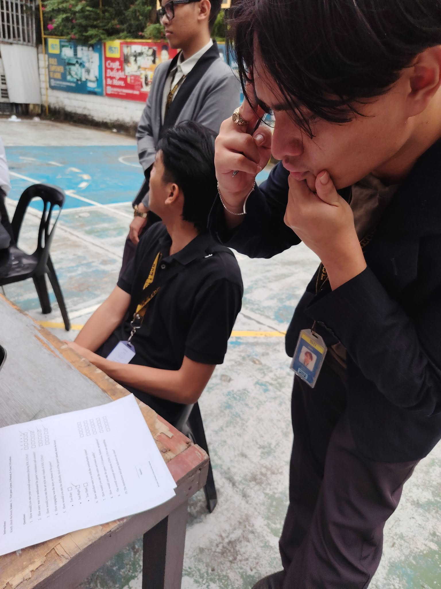
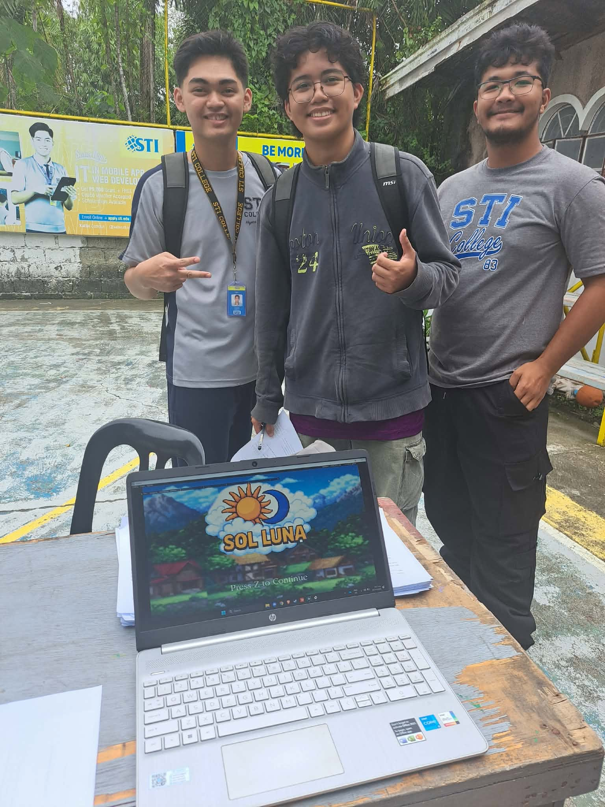
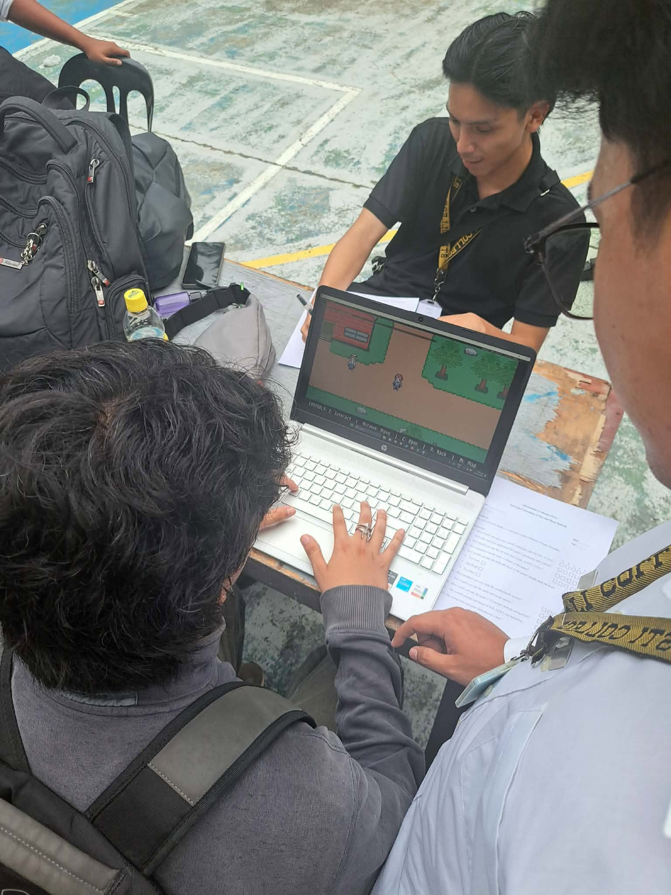
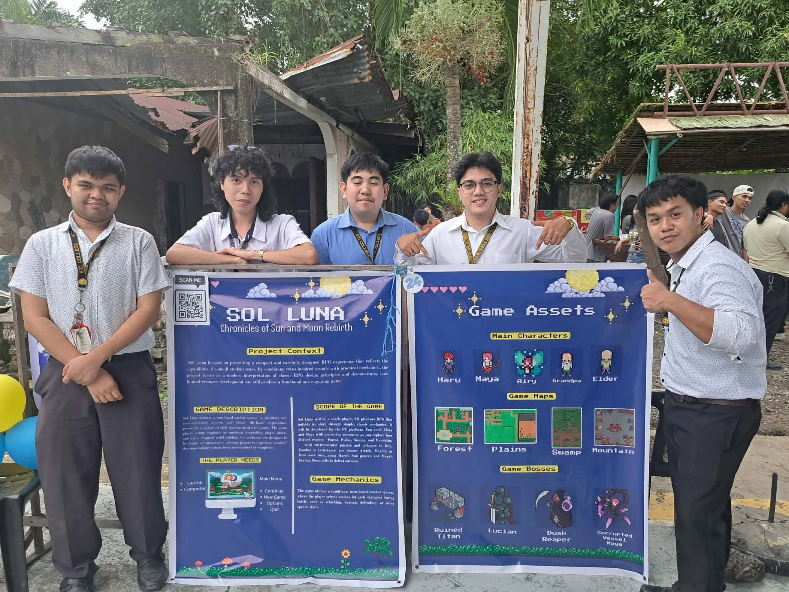

# SolLuna: Chronicles of the Sun and Moon's Rebirth

> A 2D pixel-art turn-based RPG — Capstone Project for the Bachelor of Science in Information Technology, STI College Kalibo.

## About the Project

**SolLuna: Chronicles of the Sun and Moon's Rebirth** is a single-player, 2D turn-based role-playing game set in a fantasy medieval world. It follows **Haru** and **Maya**, two protagonists bound to the powers of the light and dark, as they journey through four regions — **Forest, Plains, Swamp, and Mountains** — to uncover the truth behind a spreading curse and restore balance to their world.

The project was developed as a capstone requirement to demonstrate effective game system integration using limited resources, blending traditional RPG mechanics with emotional, narrative-driven storytelling and a nostalgic pixel-art style.

## Features

- ⚔️ **Turn-Based Combat** — Choose between Attack, Magic, or Item each turn, combining Haru's Sun powers with Maya's Moon-based healing gifts
- 🗺️ **Tile-Based Exploration** — Traverse four distinct regions filled with environmental puzzles and NPCs
- 🎒 **Inventory & Rune System** — Collect potions, equipment, and shards; customize stats through rune-based upgrades
- 👹 **Boss Encounters** — Defeat Act Bosses to collect Insignia Fragments and unlock new areas
- 💬 **Dialogue & Narrative Progression** — Chapter-based story structure exploring themes of balance, sacrifice, and growth
- 🎨 **Pixel-Art Visual Style** — Hand-crafted assets made in Aseprite for a retro JRPG feel

## Built With

- **Engine:** GameMaker Studio 2 (GML)
- **Art Tools:** Aseprite

## Development Team

- Michael B. Tosco
- Mark I. Rellin
- Emmanuel Tumbocon
- Pol Adrejan B. Suganob

**Capstone Project Adviser:** Carl Emm Salido
**Program:** BS Information Technology, STI College Kalibo

## Screenshots

*Photos from our campus playtest event, where students got to try out SolLuna and give feedback.*

<table>
  <tr>
    <td></td>
    <td></td>
  </tr>
  <tr>
    <td></td>
    <td></td>
  </tr>
</table>

## Acknowledgments

Special thanks to the students and faculty of STI College Kalibo who took part in our playtest event and helped shape SolLuna through their feedback.
